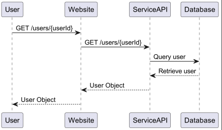
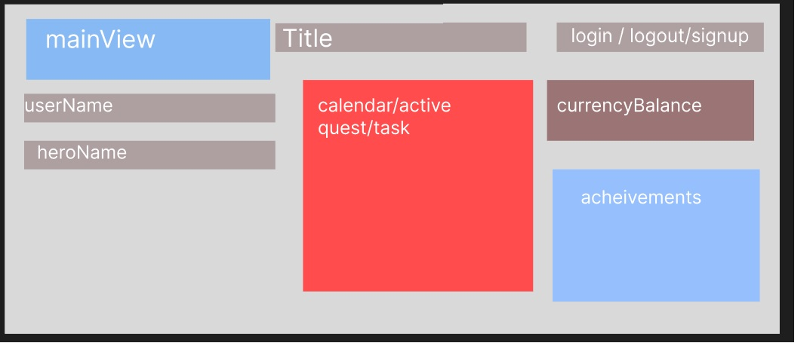
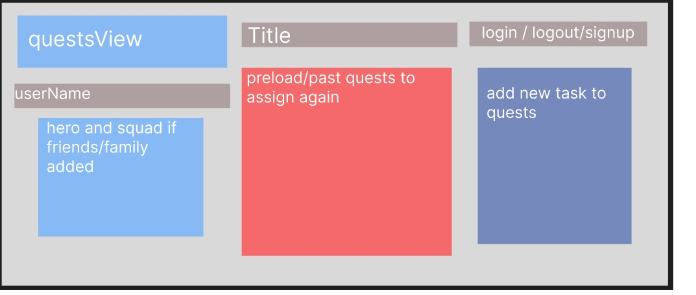
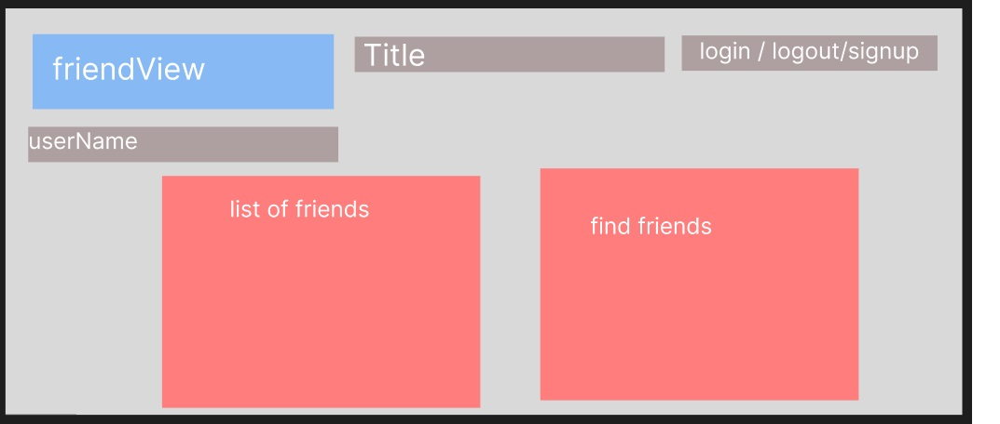
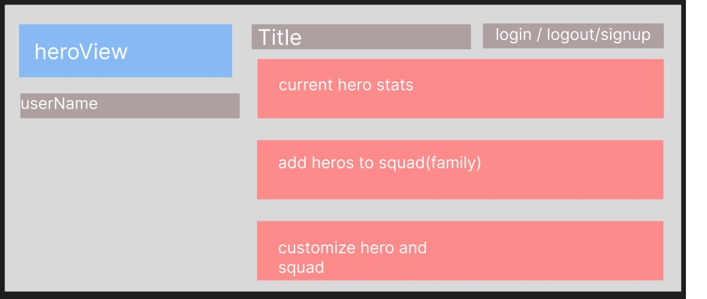
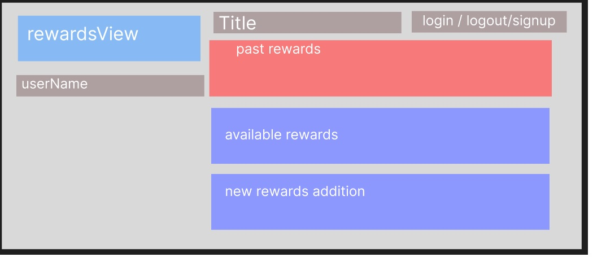

# [team name] Design Document

## *Project Title* Design

## 1. Problem Statement

Gameify your life for yourself and your family, better organize and encourage participation in accomplishing daily life goals.

## 2. Top Questions to Resolve in Review

1.   How do I motivate myself to create healthy habits?
2.   How do I motivate my family to accomplish tasks and goals?
3.   How do I reliably remind myself of things I need to do in the future?
4.   How do I have a cool customizable avatar that shows I have earned a lot of currency?

## 3. Use Cases

*This is where we work backwards from the customer and define what our customers
would like to do (and why). You may also include use cases for yourselves, or
for the organization providing the product to customers.*

As a GYST customer, I want to be reminded of things I have planned.  
As a GYST customer, I want to receive gold coins when I achieve my goals.  
As a GYST customer, I want to buy things with my gold coins such as items for my avatar or rewards in real life.  
As a GYST customer, I want to interact with other users to accomplish quests together.

## 4. Project Scope

*Clarify which parts of the problem you intend to solve. It helps reviewers know
what questions to ask to make sure you are solving for what you say and stops
discussions from getting sidetracked by aspects you do not intend to handle in
your design.*

- **Project Name:** G.Y.S.T. Get Your Stuff Together
- **Project Goal:** To create a productivity app that helps users stay organized and motivated.
- **Functional Requirements:**

  - The app must allow users to create and manage to-do lists.
  - The app must allow users to set goals and track their progress.
  - The app must allow users to earn gold coins for achieving goals.
  - The app must allow users to spend gold coins on items for their avatar or real-world rewards.
  - The app must allow users to interact with other users to accomplish quests together.
- **Non-Functional Requirements:**
  - The app must be available on both iOS and Android devices.
  - The app must be secure and protect users' data.
  - The app must be user-friendly and easy to use.

### 4.1. In Scope
*Which parts of the problem defined in Sections 1 and 3 will you solve with this
design?*

We will solve problems 1 and 2 by creating a currency and a store where you can choose among predefined items or create custom items you can buy with the currency. We will also add competition by adding the ability to interact with other users and share goals to compete on who gets the most points.  
We will solve problem 3 by adding a calendar system where you will be able to record dates and times of when important events will be taking place.  
We will solve problem 4 by adding a rewards section where the user can redeem predefined rewards or other items.  

### 4.2. Out of Scope
*Based on your problem description in Sections 1 and 3, are there any aspects
you are not planning to solve? Do potential expansions or related problems occur
to you that you want to explicitly say you are not worrying about now? Feel free
to put anything here that you think your team can't accomplish in the unit, but
would love to do with more time.*

- **Non-Functional Requirements:**
    - The app must be available on both iOS and Android devices.
    - The app must be secure and protect users' data.
    - The app must be user-friendly and easy to use.

# 5. Proposed Architecture Overview

*Describe broadly how you are proposing to solve for the requirements you
described in Section 3.*

*This may include class diagram(s) showing what components you are planning to
build.*

*You should argue why this architecture (organization of components) is
reasonable. That is, why it represents a good data flow and a good separation of
concerns. Where applicable, argue why this architecture satisfies the stated
requirements.*

I propose to keep track of tasks and the times that they should be done and organizing
them in a visually appealing calendar for the user. The user will hava a virtual avatar
that will be going through an adventure game highly dependent on whether tasks are completed.
If the user wants their avatar to succeed in the adventure game they will have to be diligent
in completing their tasks. The game will be losable with checkpoints and will have rewards
such as experience, currency, and items. Users will be able to interact and see each other's
avatars.

# 6. API

## 6.1. Public Models

*Define the data models your service will expose in its responses via your
*`-Model`* package. These will be equivalent to the *`PlaylistModel`* and
*`SongModel`* from the Unit 3 project.*

**Models**
1. UserModel
2. HeroModel
3. TaskModel
4. CampaignModel
5. QuestModel
6. RewardModel
7. ItemModel

## 6.2 Endpoints

1. Users
   - **GET /users/{userId}**: Retrieve the details of a specific user identified by *userId*.
   - **POST /users**: Create a new user with the provided user data.
   - **PUT /users/{userId}**: Update the details of a specific user identified by *userId*.
   - **DELETE /users/{userId}**: Delete a specific user identified by *userId*.
2. Heroes
   - **GET /heroes/{userId}**: Retrieve the details of a specific hero identified by *userId*.
   - **PUT /heroes/{userId}**: Update the details of a specific hero identified by *userId*.
3. Tasks
   - **GET /tasks**: Retrieve a list of all tasks.
   - **GET /tasks/{taskId}**: Retrieve the details of a specific task identified by *taskId*.
   - **POST /tasks**: Create a new task with the provided task data.
   - **PUT /tasks/{taskId}**: Update the details of a specific task identified by *taskId*.
   - **DELETE /tasks/{taskId}**: Delete a specific task identified by *taskId*.
4. Quests
   - **GET /quests**: Retrieve a list of all quests.
   - **GET /quests/{questId}**: Retrieve the details of a specific quest identified by *questId*.
   - **POST /quests**: Create a new quest with the provided task data.
   - **PUT /quests/{questId}**: Update the details of a specific quest identified by *questId*.
   - **DELETE /quests/{questId}**: Delete a specific quest identified by *questId*.
5. Campaigns
   - **GET /campaigns**: Retrieve a list of all campaigns.
   - **GET /campaigns/{campaignId}**: Retrieve the details of a specific campaign identified by *campaignId*.
   - **POST /campaigns**: Create a new campaign with the provided task data.
   - **PUT /campaigns/{campaignId}**: Update the details of a specific campaign identified by *campaignId*.
   - **DELETE /campaigns/{campaignId}**: Delete a specific campaign identified by *campaignId*.
6. Rewards
   - **GET /rewards**: Retrieve a list of all rewards.
   - **GET /rewards/{rewardId}**: Retrieve the details of a specific reward identified by *rewardId*.
   - **POST /rewards**: Create a new reward with the provided task data.
   - **PUT /rewards/{rewardId}**: Update the details of a specific reward identified by *rewardId*.
   - **DELETE /rewards/{rewardId}**: Delete a specific reward identified by *rewardId*.
7. Items
   - **GET /items**: Retrieve a list of all items.
   - **GET /items/{itemId}**: Retrieve the details of a specific item identified by *itemId*.
   - **POST /items**: Create a new item with the provided task data.
   - **PUT /items/{itemId}**: Update the details of a specific item identified by *itemId*.
   - **DELETE /items/{itemId}**: Delete a specific item identified by *itemId*.

## 6.3. *First Endpoint*

*Describe the behavior of the first endpoint you will build into your service
API. This should include what data it requires, what data it returns, and how it
will handle any known failure cases. You should also include a sequence diagram
showing how a user interaction goes from user to website to service to database,
and back. This first endpoint can serve as a template for subsequent endpoints.
(If there is a significant difference on a subsequent endpoint, review that with
your team before building it!)*

*(You should have a separate section for each of the endpoints you are expecting
to build...)*

The first endpoint we will build into the service API is the ***GET /users/{userId}*** endpoint.  
**Data Required**: The endpoint requires the 'username' of the user to be provided.   
**Data Returned**: The endpoint will return a JSON response containing the user
object matching the provided username. It will include attributes such as: *username*,
*friends*, *avatar*, and *firstName* and *lastName* if public.   
**Failure Case Handling**: 
- If there is an error connecting to the database or retrieving
the user data, the endpoint can return an appropriate error response with an error message,
such as a 500 Internal Server Error.
- If no user is found with the provided username, the endpoint can return a 404 Not Found
status code with an error message indicating that the user does not exist.   

**Sequence Diagram**:   

## 6.4 *Second Endpoint*

*(repeat, but you can use shorthand here, indicating what is different, likely
primarily the data in/out and error conditions. If the sequence diagram is
nearly identical, you can say in a few words how it is the same/different from
the first endpoint)*

# 7. Tables

*Define the DynamoDB tables you will need for the data your service will use. It
may be helpful to first think of what objects your service will need, then
translate that to a table structure, like with the *`Playlist` POJO* versus the
`playlists` table in the Unit 3 project.*

**Tables**

- users
    - userId  // int
    - username  // String
    - firstName  // String
    - lastName  // String
    - email  // String
    - password  // String
    - friendIds  // List<int>(users table)
    - avatarId  // int(avatars table)

- heroes
    - userId  // int(users table)
    - name  // String
    - level  // int
    - experience  // int
    - health  // int
    - currency  // int
    - itemIds  // List<int>(items table)

- tasks
    - taskId  // int
    - name  // String
    - description  // String
    - difficulty  // String
    - completed // int
    - frequency // DateRange
    - deadline  // LocalDate
    - rewardId  // int(rewards table)

- quests
    - questId  // int
    - name  // String
    - taskIds  // List<int>(tasks table)
    - completed  // boolean
    - difficulty  // String
    - duration  // String
    - dueDate  // DateRange
    - deadline  // LocalDate
    - rewardId  // int(rewards table)

- campaigns
    - campaignId  // int
    - name  // String
    - questIds  // List<int>(quests table)

- items
    - itemId  // int
    - name  // String
    - description  // String
    - rarity  // String

- rewards
    - rewardId  // int
    - name  // String
    - description  // String
    - currency  // int
    - experience  // int
    - itemIds  // List<int>(items table)

# 8. Pages

*Include mock-ups of the web pages you expect to build. These can be as
sophisticated as mockups/wireframes using drawing software, or as simple as
hand-drawn pictures that represent the key customer-facing components of the
pages. It should be clear what the interactions will be on the page, especially
where customers enter and submit data. You may want to accompany the mockups
with some description of behaviors of the page (e.g. “When customer submits the
submit-dog-photo button, the customer is sent to the doggie detail page”)*

